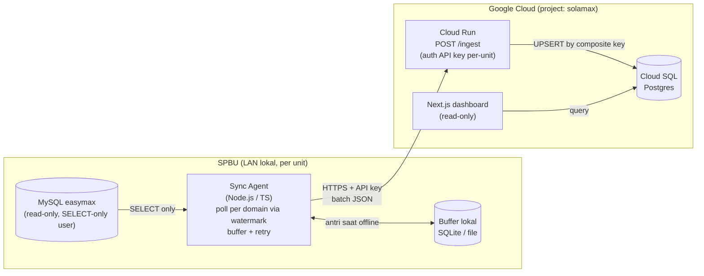

# SolaMax — Arsitektur (Fase 0)

> Status: **RANCANGAN — menunggu approval**. Dokumen ini hasil Fase 0 (investigasi & rancangan).
> Belum ada kode aplikasi sampai rancangan ini disetujui dan daftar query verifikasi
> ([VERIFICATION-QUERIES.sql](VERIFICATION-QUERIES.sql)) dijalankan + dilaporkan.
>
> Sumber skema: `wikis/spbu-sola/wiki/concepts/easymax-data-model.md` (recon Imam Bonjol 6478111).
> **Skema belum diverifikasi pada DB nyata** — semua keputusan PK/tipe di bawah bertanda ⚠️ wajib dikonfirmasi.

---

## 1. Tujuan & batasan

- **Tujuan:** tarik data POS EasyMax (penjualan, kas, stok) berkala → simpan di cloud → tampilkan di dashboard pengawasan kepatuhan input pengawas, real-time, lintas SPBU.
- **Pilot:** 1 unit (Imam Bonjol, kode `6478111`). **Arsitektur wajib siap replikasi ke 7 SPBU** — agent identik, beda API key + config.
- **🔒 Keselamatan (tak bisa dinegosiasi):**
  - Koneksi ke MySQL `easymax` **HARUS read-only** (user MySQL ber-privilege `SELECT` saja).
  - Agent **tidak boleh** pernah eksekusi `INSERT`/`UPDATE`/`DELETE`/DDL ke `easymax`. Ditegakkan di kode (whitelist: hanya `SELECT`) + didokumentasikan cara buat user `SELECT`-only.
  - **Tidak ada kredensial di git.** Semua via env / config file yang di-`.gitignore`.

---

## 2. Alur data



**Prinsip:**
- Agent **push** keluar (HTTPS). MySQL tidak pernah diekspos ke internet.
- Idempoten: UPSERT by composite key → kirim ulang aman.
- Tahan offline: buffer lokal + retry.
- Histori tersimpan di cloud; DB lokal EasyMax tetap utuh.

---

## 3. Skema Postgres tujuan

Konvensi: semua tabel data punya kolom **`unit_id`** (multi-tenant; pilot = 1 baris). Kolom mirror memakai nama EasyMax di-`snake_case` agar mudah dilacak ke sumber. Watermark/waktu disimpan `timestamptz` (lihat catatan timezone §6).

> ✅ **CONFIRMED** (verifikasi 2026-06-11, DB Imam Bonjol). Semua keputusan PK/tipe di bawah
> sudah terkunci by data. Lihat ringkasan temuan di [§0 Temuan terkunci](#0-temuan-terkunci).
>
> **Konvensi PK Postgres:** tabel detail EasyMax **tanpa PRIMARY KEY** di MySQL
> (`tr_djualbbm`, `tr_dkasbank`, `tr_dopnamebbm`) memakai **surrogate `id bigserial` +
> `UNIQUE` index pada natural key** (natural key sudah dibuktikan unik → UNIQUE aman, dan
> jadi target `ON CONFLICT` untuk UPSERT). Tabel dengan PK sumber (`tr_terimabbm.CKDTRM`,
> semua header, master) memakai natural PK langsung (di-scope `unit_id`).

### 0. Temuan terkunci

Empat fakta dari verifikasi yang membentuk desain (bukan asumsi):

1. **`DTGLJAM` NULLABLE — sync data live saja.** `tr_djualbbm` punya 12.737 baris (~7%) `DTGLJAM IS NULL`, semua legacy pra-`2022-08-31`. Agent **hanya** tarik baris `DTGLJAM IS NOT NULL`; baris legacy NULL **diabaikan** dan **tak boleh menggeser watermark**. (opname & terima: 0 NULL.)
2. **Modul KAS dorman sejak 2019** (`tr_hkasbank` berhenti `2019-04-17`). Domain kas **tetap dibangun penuh**; dashboard menampilkan "terakhir input: `<tgl>`" + **flag merah bila stale** — ini justru fitur pengawasan inti.
3. **MySQL 5.0.67 (2008).** Driver Node **wajib kompatibel 5.0** (handshake/auth lawas) — **tes koneksi paling awal di Fase 1**. Query agent **tak boleh** pakai fitur SQL modern.
4. **Timezone server = `SYSTEM` = WIB (UTC+7), tanpa offset tersimpan.** `DTGLJAM` diperlakukan sebagai WIB lalu **dikonversi eksplisit ke UTC** saat simpan ke `timestamptz` Postgres.

### 3.1 Master & kontrol

```sql
-- Master SPBU
CREATE TABLE unit (
  unit_id       smallint PRIMARY KEY,
  code          text NOT NULL UNIQUE,        -- mis. '6478111'
  name          text NOT NULL,               -- 'Imam Bonjol'
  api_key_hash  text NOT NULL,               -- hash API key (bukan plaintext)
  timezone      text NOT NULL DEFAULT 'Asia/Pontianak',
  active        boolean NOT NULL DEFAULT true,
  created_at    timestamptz NOT NULL DEFAULT now()
);

-- Watermark per domain per unit
CREATE TABLE sync_state (
  unit_id         smallint NOT NULL REFERENCES unit(unit_id),
  domain          text NOT NULL,             -- 'sales' | 'cash' | 'opname' | 'delivery'
  last_watermark  timestamptz,               -- kas: pakai batas hari (lihat §5)
  last_run_at     timestamptz,
  last_row_count  integer,
  PRIMARY KEY (unit_id, domain)
);
```

### 3.2 Domain 1 — Penjualan BBM ⭐

```sql
-- mirror tr_hjualbbm (per shift per hari) — PK sumber: CKDJUALBBM
CREATE TABLE sales_header (
  unit_id     smallint NOT NULL REFERENCES unit(unit_id),
  ckdjualbbm  char(15) NOT NULL,
  dtgljual    date NOT NULL,                 -- tanggal BISNIS (grouping harian)
  nshift      smallint,                      -- ✅ {1,2,3}
  vcket       text,
  PRIMARY KEY (unit_id, ckdjualbbm)
);

-- mirror tr_djualbbm (per nozzle) — tabel emas
-- ✅ Natural key (CKDJUALBBM,CKDNOZZLE,NURUT) UNIK (181.684 = distinct). MySQL: tanpa PRI
--    → Postgres pakai surrogate id + UNIQUE. dtgljam NOT NULL (agent filter IS NOT NULL).
CREATE TABLE sales_detail (
  id           bigserial PRIMARY KEY,
  unit_id      smallint NOT NULL REFERENCES unit(unit_id),
  ckdjualbbm   char(15) NOT NULL,
  ckdnozzle    char(5)  NOT NULL,
  nurut        integer  NOT NULL,            -- no urut koreksi
  nstandawal   numeric,
  nstandakhir  numeric,
  nvolume      numeric,
  nhargajual   numeric,
  nsubtotal    numeric,
  ckdbbm       char(5),
  ckdtangki    char(5),
  vcopeator    text,
  dtgljam      timestamptz NOT NULL,         -- watermark (hanya baris non-NULL disync)
  subah        smallint,                     -- flag koreksi
  sedit        smallint,                     -- flag edit
  ingested_at  timestamptz NOT NULL DEFAULT now(),
  UNIQUE (unit_id, ckdjualbbm, ckdnozzle, nurut)   -- target ON CONFLICT
);
CREATE INDEX ix_sales_detail_dtgljam ON sales_detail (unit_id, dtgljam);
CREATE INDEX ix_sales_header_dtgljual ON sales_header (unit_id, dtgljual);
```

### 3.3 Domain 2 — Kas / Pengeluaran (dorman sejak 2019, tetap dibangun)

```sql
-- mirror tr_hkasbank — PK sumber: CKDKB. SBATAL = flag batal (ikut disync).
CREATE TABLE cash_header (
  unit_id    smallint NOT NULL REFERENCES unit(unit_id),
  ckdkb      char(15) NOT NULL,
  dtgl       date NOT NULL,                  -- tanggal bisnis = watermark (date) → re-scan 7 hari
  vcket      text,
  sjnstrans  smallint,                       -- jenis masuk/keluar
  ntotal     numeric,
  vcref      text,
  ctmpkas    text,
  sbatal     smallint,                       -- ✅ flag batal → dashboard tandai/filter
  ingested_at timestamptz NOT NULL DEFAULT now(),
  PRIMARY KEY (unit_id, ckdkb)
);
CREATE INDEX ix_cash_header_dtgl ON cash_header (unit_id, dtgl);

-- mirror tr_dkasbank — ✅ natural key (CKDKB,CKDPERK) UNIK (2.942 = distinct, tanpa line-id).
--    MySQL tanpa PRI → surrogate id + UNIQUE. CKDPERK → join master account (tm_perk).
CREATE TABLE cash_detail (
  id        bigserial PRIMARY KEY,
  unit_id   smallint NOT NULL REFERENCES unit(unit_id),
  ckdkb     char(15) NOT NULL,
  ckdperk   char(8),                         -- kode akun → account.ckdperk
  njumlah   numeric,
  ingested_at timestamptz NOT NULL DEFAULT now(),
  UNIQUE (unit_id, ckdkb, ckdperk)           -- target ON CONFLICT
);
```

### 3.4 Domain 3 — Stok & Penerimaan

```sql
-- mirror tr_hopnamebbm + tr_dopnamebbm (digabung). Detail tanpa PRI di MySQL.
-- ✅ Natural key (CKDOPNBBM,CKDTANGKI) UNIK (28.987 = distinct). SBATAL dari header.
CREATE TABLE opname (
  id          bigserial PRIMARY KEY,
  unit_id     smallint NOT NULL REFERENCES unit(unit_id),
  ckdopnbbm   char(15) NOT NULL,
  ckdtangki   char(5)  NOT NULL,
  ckdbbm      char(5),
  dtaglopn    date,                           -- tanggal bisnis opname (dari header)
  nstockbk    numeric,                        -- stok buku
  nstockop    numeric,                        -- stok fisik
  nvolselisih numeric,                        -- selisih / losses (flag abnormal)
  dtgljam     timestamptz NOT NULL,           -- watermark (0 NULL di data)
  sbatal      smallint,                       -- flag batal (dari header)
  ingested_at timestamptz NOT NULL DEFAULT now(),
  UNIQUE (unit_id, ckdopnbbm, ckdtangki)      -- target ON CONFLICT
);
CREATE INDEX ix_opname_dtgljam ON opname (unit_id, dtgljam);

-- mirror tr_terimabbm (penerimaan dari Pertamina)
-- ✅ PK sumber = CKDTRM (PRI) → natural PK langsung. SBATAL = flag batal.
CREATE TABLE delivery (
  unit_id     smallint NOT NULL REFERENCES unit(unit_id),
  ckdtrm      char(15) NOT NULL,              -- PK sumber
  dtgltrm     date,                           -- tanggal bisnis terima
  dtgljam     timestamptz NOT NULL,           -- watermark (0 NULL di data)
  cnodo       text,                           -- no DO
  nvoldo      numeric,
  nvolreal    numeric,
  nvolselisih numeric,                        -- kekurangan kiriman
  cnopol      text,
  vcsopir     text,
  ckdtangki   char(5),
  ckdbbm      char(5),
  sbatal      smallint,                       -- flag batal
  ingested_at timestamptz NOT NULL DEFAULT now(),
  PRIMARY KEY (unit_id, ckdtrm)
);
CREATE INDEX ix_delivery_dtgljam ON delivery (unit_id, dtgljam);
```

### 3.5 Master (sync penuh berkala — kecil, jarang berubah)

```sql
-- tm_bbm (produk). Punya kolom CKDPERK* mapping produk→akun → simpan apa adanya (jsonb).
CREATE TABLE product (
  unit_id   smallint NOT NULL REFERENCES unit(unit_id),
  ckdbbm    char(5) NOT NULL,
  vcnmbbm   text,
  nhrgjual  numeric,
  perk_map  jsonb,                            -- kolom CKDPERK* dari tm_bbm, as-is
  PRIMARY KEY (unit_id, ckdbbm)
);

-- tm_nozzle (nozzle → pompa, tangki)
CREATE TABLE nozzle (
  unit_id    smallint NOT NULL REFERENCES unit(unit_id),
  ckdnozzle  char(5) NOT NULL,
  ckdpompa   char(5),
  ckdtangki  char(5),
  PRIMARY KEY (unit_id, ckdnozzle)
);

-- tm_tangki (tangki)
CREATE TABLE tangki (
  unit_id    smallint NOT NULL REFERENCES unit(unit_id),
  ckdtangki  char(5) NOT NULL,
  ckdbbm     char(5),
  vcnmtangki text,
  PRIMARY KEY (unit_id, ckdtangki)
);

-- tm_perk (chart-of-accounts; + tm_indukperk hierarki induk). Untuk nama kategori pengeluaran.
CREATE TABLE account (
  unit_id    smallint NOT NULL REFERENCES unit(unit_id),
  ckdperk    char(8) NOT NULL,
  vcnmperk   text,                            -- nama akun
  ckdinduk   char(8),                         -- → tm_indukperk
  PRIMARY KEY (unit_id, ckdperk)
);
```

---

## 4. Kontrak API `/ingest`

```
POST /ingest
Authorization: Bearer <API_KEY>      # per-unit; backend map key → unit_id
Content-Type: application/json
```

**Domain = grup watermark** (bukan 1 tabel). Satu domain bisa membawa beberapa tabel target
sekaligus (sales = header+detail) yang ter-commit **atomik** dengan satu watermark.

`domain` ∈ `sales | cash | opname | delivery | masters`.

**Request body**
```jsonc
{
  "unit_code": "6478111",
  "domain": "sales",
  "watermark_high": "2026-06-11T07:30:00Z", // UTC. max(dtgljam) non-NULL di batch; null utk masters
  "tables": {                                // peta tabel target → baris (snake_case kolom sumber)
    "sales_header": [ { "ckdjualbbm": "...", "dtgljual": "2026-06-11", "nshift": 2 } ],
    "sales_detail": [ { "ckdjualbbm": "...", "ckdnozzle": "...", "nurut": 1, "dtgljam": "2026-06-11T07:30:00Z" } ]
  }
}
```

**Response 200**
```jsonc
{
  "upserted": { "sales_header": 3, "sales_detail": 42 },
  "new_watermark": "2026-06-11T07:30:00Z"
}
```

**Aturan:**
- Auth gagal → `401`. `unit_code` tak match key → `403`. Payload invalid → `422` (tak commit apa pun).
- Semua tabel dalam satu request ter-commit dalam **satu transaksi**. UPSERT by natural key (§3, `ON CONFLICT`) → **idempoten**; kirim ulang aman (re-scan trailing window mengandalkan ini).
- Backend update `sync_state(unit_id, domain).last_watermark = watermark_high` **hanya** setelah transaksi commit.
- Limit ~1000 baris/tabel/request; agent memecah (paginate) bila lebih.

---

## 5. Strategi watermark & re-scan

| Domain    | Tabel sumber                 | Watermark           | Strategi poll |
|-----------|------------------------------|---------------------|---------------|
| sales     | `tr_djualbbm` (+header,+bbm) | `DTGLJAM` (datetime)| `WHERE DTGLJAM IS NOT NULL AND DTGLJAM > :wm − safety_window`; UPSERT (flag `SUBAH`/`SEDIT` → baris lama bisa berubah) |
| opname    | `tr_dopnamebbm` (+header)    | `DTGLJAM`           | sama (0 NULL di data); UPSERT |
| delivery  | `tr_terimabbm`               | `DTGLJAM`           | sama (0 NULL); UPSERT by `CKDTRM` |
| cash      | `tr_hkasbank` (+detail)      | `DTGL` (date only)  | **re-scan window 7 hari**: `WHERE DTGL >= :wm − 7d`; UPSERT. **Dorman sejak 2019** — query tetap jalan, hasil 0 baris normal |
| master    | `tm_bbm`/`tm_nozzle`/`tm_tangki`/`tm_perk` | — | sync penuh berkala (kecil) |

- **🔑 `DTGLJAM IS NOT NULL` wajib di domain sales.** ~7% baris legacy (pra-2022-08) bernilai NULL; baris ini **tak disync** dan **tak boleh menggeser** `last_watermark`. Watermark baru = `MAX(DTGLJAM)` dari baris non-NULL yang ter-commit.
- **Safety window** (sales/opname/delivery): re-query trailing N menit untuk menangkap baris yang ditulis terlambat / dikoreksi (`SUBAH`/`SEDIT`). Nilai default **N = 60 menit** (dari sebaran lag DTGLJAM↔DTGLJUAL); dibuat config-driven agar mudah disetel.
- **Grain penjualan:** grouping harian pakai `DTGLJUAL` (tanggal bisnis); poll inkremental pakai `DTGLJAM`. Shift 3 malam bisa `DTGLJAM` beda hari dgn `DTGLJUAL` — ditangani karena keduanya disimpan.
- **Baris dibatalkan (`SBATAL`)** di kas/opname/delivery tetap disync (bukan difilter di agent) → dashboard yang menandai/menyaring; pengawasan butuh tahu ada pembatalan.

---

## 6. Catatan timezone

✅ Server EasyMax Imam Bonjol: `time_zone = SYSTEM = WIB (UTC+7)`, `datetime` **tanpa offset tersimpan**. Agent memperlakukan `DTGLJAM` sebagai WIB lalu **mengonversi eksplisit ke UTC** saat menyimpan ke `timestamptz` Postgres (jangan biarkan driver/OS menebak). Timezone per-unit ada di `unit.timezone` (Imam Bonjol = `Asia/Pontianak`, WIB/UTC+7). ⚠️ Konfirmasi ulang `@@time_zone` mesin tiap SPBU saat replikasi (Pontianak juga WIB, tapi verifikasi).

---

## 7. Status verifikasi — ✅ TERKUNCI (2026-06-11)

Query read-only ada di **[VERIFICATION-QUERIES.sql](VERIFICATION-QUERIES.sql)**. Semua terjawab:

| ID         | Hasil terkunci |
|------------|----------------|
| Q-CASH-1   | ✅ `(CKDKB,CKDPERK)` unik (2.942=distinct), **tak ada line-id** → surrogate `id` + UNIQUE |
| Q-CASH-2   | ✅ Chart-of-accounts = `tm_perk` (+`tm_indukperk`, view `vw_masterperk`) → tabel `account` |
| Q-CASH-3   | ✅ `SJNSTRANS` disimpan apa adanya; modul kas dorman sejak 2019 (low priority dekode) |
| Q-OPN-1    | ✅ `(CKDOPNBBM,CKDTANGKI)` unik (28.987=distinct) → surrogate `id` + UNIQUE |
| Q-TRM-1    | ✅ PK sumber = `CKDTRM` (PRI) → natural PK `(unit_id, ckdtrm)` |
| Q-SALES-1  | ✅ `(CKDJUALBBM,CKDNOZZLE,NURUT)` unik (181.684=distinct) → surrogate `id` + UNIQUE |
| Q-SALES-2  | ✅ `NSHIFT ∈ {1,2,3}` smallint; `SUBAH`/`SEDIT` disync untuk deteksi koreksi |
| Q-SALES-3  | ✅ `DTGLJAM` NULLABLE (~7% legacy pra-2022-08) → filter `IS NOT NULL`; safety window 60m |
| Q-TZ       | ✅ `SYSTEM`=WIB (UTC+7), datetime tanpa offset → konversi eksplisit ke UTC |
| Q-SCHEMA   | ✅ MySQL **5.0.67** — driver wajib kompatibel 5.0; tipe & nama kolom dikonfirmasi |

---

## 8. Stack & struktur repo (rencana)

- **Monorepo** (pnpm workspaces):
  - `apps/agent` — Sync agent Node.js/TS (Fase 1)
  - `apps/backend` — NestJS + Prisma, endpoint `/ingest` (Fase 2)
  - `apps/dashboard` — Next.js (Fase 3)
  - `packages/shared` — tipe domain & skema validasi payload (dipakai agent + backend)
- DB: Postgres (Prisma migrations). Cloud: GCP (Cloud Run + Cloud SQL), project `solamax`.
- Konfigurasi rahasia: `.env` + config file, **di-`.gitignore`**.
- **Driver MySQL agent wajib kompatibel MySQL 5.0.67** (handshake/auth lawas). `mysql2`
  mendukungnya tapi perlu opsi auth lawas — divalidasi di smoke test Fase 1 paling awal.

> **Fase 1 (`apps/agent`) sedang dibangun.** Backend & dashboard menyusul per gate.

---

## ✅ Status fase

- **Fase 0** — selesai & terverifikasi (skema di atas TERKUNCI).
- **Fase 1** — selesai; smoke-test mesin SPBU **LULUS** (2026-06-11: mysql2 ↔ 5.0.67 OK, TZ WIB, paginasi & filter NULL terbukti, masters cocok recon).
- **Fase 2** — backend `/ingest` (NestJS+Prisma, `apps/backend`) terbangun: auth API-key per-unit, UPSERT bulk atomik per transaksi (+`sync_state` ikut commit). Gate: **deploy staging + satu sync E2E** oleh user ([`apps/backend/DEPLOY-GCP.md`](apps/backend/DEPLOY-GCP.md)).
- **Fase 3** (dashboard) — menunggu E2E + approval.
