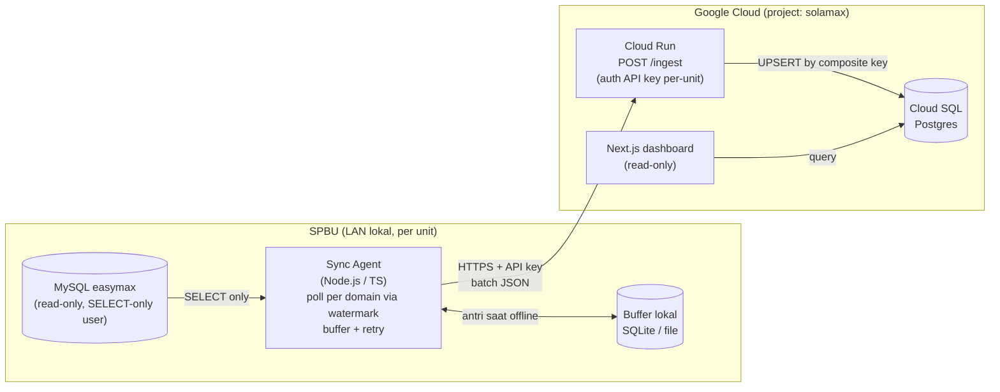

# SolaMax — Arsitektur (Fase 0)

> Status: **RANCANGAN — menunggu approval**. Dokumen ini hasil Fase 0 (investigasi & rancangan).
> Belum ada kode aplikasi sampai rancangan ini disetujui dan daftar query verifikasi
> ([VERIFICATION-QUERIES.sql](VERIFICATION-QUERIES.sql)) dijalankan + dilaporkan.
>
> Sumber skema: `wikis/spbu-sola/wiki/concepts/easymax-data-model.md` (recon Imam Bonjol 6478111).
> **Skema belum diverifikasi pada DB nyata** — semua keputusan PK/tipe di bawah bertanda ⚠️ wajib dikonfirmasi.

---

## 1. Tujuan & batasan

- **Tujuan:** tarik data POS EasyMax (penjualan, kas, stok) berkala → simpan di cloud → tampilkan di dashboard pengawasan kepatuhan input pengawas, real-time, lintas SPBU.
- **Pilot:** 1 unit (Imam Bonjol, kode `6478111`). **Arsitektur wajib siap replikasi ke 7 SPBU** — agent identik, beda API key + config.
- **🔒 Keselamatan (tak bisa dinegosiasi):**
  - Koneksi ke MySQL `easymax` **HARUS read-only** (user MySQL ber-privilege `SELECT` saja).
  - Agent **tidak boleh** pernah eksekusi `INSERT`/`UPDATE`/`DELETE`/DDL ke `easymax`. Ditegakkan di kode (whitelist: hanya `SELECT`) + didokumentasikan cara buat user `SELECT`-only.
  - **Tidak ada kredensial di git.** Semua via env / config file yang di-`.gitignore`.

---

## 2. Alur data



**Prinsip:**
- Agent **push** keluar (HTTPS). MySQL tidak pernah diekspos ke internet.
- Idempoten: UPSERT by composite key → kirim ulang aman.
- Tahan offline: buffer lokal + retry.
- Histori tersimpan di cloud; DB lokal EasyMax tetap utuh.

---

## 3. Skema Postgres tujuan

Konvensi: semua tabel data punya kolom **`unit_id`** (multi-tenant; pilot = 1 baris). Kolom mirror memakai nama EasyMax di-`snake_case` agar mudah dilacak ke sumber. Watermark/waktu disimpan `timestamptz` (lihat catatan timezone §6).

> 🏷️ **PROVISIONAL** = keputusan bergantung pada hasil query verifikasi (Q-ID tertera);
> belum dikunci sampai data nyata dilaporkan. **Fallback PK tebakan:** untuk tabel yang
> PK alaminya belum pasti, dipakai **surrogate key auto-increment (`id bigserial`) +
> `UNIQUE` index pada natural key**. Desain ini selamat apa pun hasil data: jika natural
> key ternyata unik, `UNIQUE` menegakkannya; jika ada duplikat, surrogate tetap memberi
> PK sah. UPSERT tetap memakai `ON CONFLICT (natural key)`.

### 3.1 Master & kontrol

```sql
-- Master SPBU
CREATE TABLE unit (
  unit_id       smallint PRIMARY KEY,
  code          text NOT NULL UNIQUE,        -- mis. '6478111'
  name          text NOT NULL,               -- 'Imam Bonjol'
  api_key_hash  text NOT NULL,               -- hash API key (bukan plaintext)
  timezone      text NOT NULL DEFAULT 'Asia/Pontianak',
  active        boolean NOT NULL DEFAULT true,
  created_at    timestamptz NOT NULL DEFAULT now()
);

-- Watermark per domain per unit
CREATE TABLE sync_state (
  unit_id         smallint NOT NULL REFERENCES unit(unit_id),
  domain          text NOT NULL,             -- 'sales' | 'cash' | 'opname' | 'delivery'
  last_watermark  timestamptz,               -- kas: pakai batas hari (lihat §5)
  last_run_at     timestamptz,
  last_row_count  integer,
  PRIMARY KEY (unit_id, domain)
);
```

### 3.2 Domain 1 — Penjualan BBM ⭐

```sql
-- mirror tr_hjualbbm (per shift per hari)
CREATE TABLE sales_header (
  unit_id     smallint NOT NULL REFERENCES unit(unit_id),
  ckdjualbbm  char(15) NOT NULL,
  dtgljual    date NOT NULL,                 -- tanggal BISNIS (grouping harian)
  nshift      smallint,                      -- 1/2/3  🏷️ PROVISIONAL Q-SALES-2 (format/nilai)
  vcket       text,
  PRIMARY KEY (unit_id, ckdjualbbm)
);

-- mirror tr_djualbbm (per nozzle) — tabel emas
-- 🏷️ PROVISIONAL (Q-SALES-1): PK natural (ckdjualbbm,ckdnozzle,nurut) dari wiki recon,
--    BELUM dikonfirmasi unik di data. Jika Q-SALES-1 menunjukkan duplikat → ganti ke
--    fallback surrogate (lihat pola cash_detail/opname/delivery).
CREATE TABLE sales_detail (
  unit_id      smallint NOT NULL REFERENCES unit(unit_id),
  ckdjualbbm   char(15) NOT NULL,
  ckdnozzle    char(5)  NOT NULL,
  nurut        integer  NOT NULL,            -- no urut koreksi
  nstandawal   numeric,
  nstandakhir  numeric,
  nvolume      numeric,
  nhargajual   numeric,
  nsubtotal    numeric,
  ckdbbm       char(5),
  ckdtangki    char(5),
  vcopeator    text,
  dtgljam      timestamptz NOT NULL,         -- watermark
  subah        smallint,                     -- flag koreksi
  sedit        smallint,                     -- flag edit
  ingested_at  timestamptz NOT NULL DEFAULT now(),
  PRIMARY KEY (unit_id, ckdjualbbm, ckdnozzle, nurut)  -- 🏷️ PROVISIONAL Q-SALES-1
);
CREATE INDEX ix_sales_detail_dtgljam ON sales_detail (unit_id, dtgljam);
CREATE INDEX ix_sales_header_dtgljual ON sales_header (unit_id, dtgljual);

-- mirror tm_bbm (master produk; jarang berubah, sync penuh)
CREATE TABLE product (
  unit_id   smallint NOT NULL REFERENCES unit(unit_id),
  ckdbbm    char(5) NOT NULL,
  vcnmbbm   text,
  nhrgjual  numeric,
  PRIMARY KEY (unit_id, ckdbbm)
);
```

### 3.3 Domain 2 — Kas / Pengeluaran

```sql
-- mirror tr_hkasbank
CREATE TABLE cash_header (
  unit_id    smallint NOT NULL REFERENCES unit(unit_id),
  ckdkb      char(15) NOT NULL,
  dtgl       date NOT NULL,                  -- watermark (date only) → re-scan 7 hari
  vcket      text,
  sjnstrans  smallint,                       -- jenis masuk/keluar 🏷️ PROVISIONAL Q-CASH-3 (arti nilai)
  ntotal     numeric,
  vcref      text,
  ctmpkas    text,
  ingested_at timestamptz NOT NULL DEFAULT now(),
  PRIMARY KEY (unit_id, ckdkb)
);
CREATE INDEX ix_cash_header_dtgl ON cash_header (unit_id, dtgl);

-- mirror tr_dkasbank
-- 🏷️ PROVISIONAL (Q-CASH-1): PK natural BELUM PASTI → pakai FALLBACK surrogate.
--    Q-CASH-1c menentukan apakah (ckdkb,ckdperk) unik. Jika unik → natural key cukup
--    & UNIQUE di bawah jadi PK efektif. Jika duplikat → surrogate `id` wajib (UPSERT
--    butuh natural key + line_no dari sumber bila ada; lihat Q-CASH-1/DESCRIBE).
CREATE TABLE cash_detail (
  id        bigserial PRIMARY KEY,           -- surrogate fallback
  unit_id   smallint NOT NULL REFERENCES unit(unit_id),
  ckdkb     char(15) NOT NULL,
  ckdperk   char(8),                         -- kode akun → chart-of-accounts (Q-CASH-2)
  njumlah   numeric,
  ingested_at timestamptz NOT NULL DEFAULT now()
  -- 🏷️ PROVISIONAL Q-CASH-1: natural key UNIQUE ditambah setelah hasil diketahui, mis.
  -- UNIQUE (unit_id, ckdkb, ckdperk)   -- bila Q-CASH-1c menunjukkan kombinasi unik
);
```

### 3.4 Domain 3 — Stok & Penerimaan

```sql
-- mirror tr_hopnamebbm + tr_dopnamebbm (digabung; header tipis)
-- 🏷️ PROVISIONAL (Q-OPN-1): PK natural tebakan → FALLBACK surrogate + UNIQUE.
--    Q-OPN-1 mengecek apakah (ckdopnbbm,ckdtangki) unik.
CREATE TABLE opname (
  id          bigserial PRIMARY KEY,          -- surrogate fallback
  unit_id     smallint NOT NULL REFERENCES unit(unit_id),
  ckdopnbbm   char(15) NOT NULL,
  ckdtangki   char(5)  NOT NULL,
  ckdbbm      char(5),
  nstockbk    numeric,                        -- stok buku
  nstockop    numeric,                        -- stok fisik
  nvolselisih numeric,                        -- selisih / losses (flag abnormal)
  dtgljam     timestamptz NOT NULL,           -- watermark
  ingested_at timestamptz NOT NULL DEFAULT now(),
  UNIQUE (unit_id, ckdopnbbm, ckdtangki)      -- 🏷️ PROVISIONAL Q-OPN-1 (target UPSERT)
);
CREATE INDEX ix_opname_dtgljam ON opname (unit_id, dtgljam);

-- mirror tr_terimabbm (penerimaan dari Pertamina)
-- 🏷️ PROVISIONAL (Q-TRM-1): kolom PK sumber belum diketahui → FALLBACK surrogate.
--    Q-TRM-1 mengecek apakah CNODO unik (kandidat natural key). UNIQUE ditambah
--    setelah kolom natural key dipastikan.
CREATE TABLE delivery (
  id          bigserial PRIMARY KEY,          -- surrogate fallback
  unit_id     smallint NOT NULL REFERENCES unit(unit_id),
  dtgltrm     date,
  dtgljam     timestamptz NOT NULL,           -- watermark
  cnodo       text,                           -- no DO (kandidat natural key — Q-TRM-1)
  nvoldo      numeric,
  nvolreal    numeric,
  nvolselisih numeric,                        -- kekurangan kiriman
  cnopol      text,
  vcsopir     text,
  ckdtangki   char(5),
  ckdbbm      char(5),
  ingested_at timestamptz NOT NULL DEFAULT now()
  -- 🏷️ PROVISIONAL Q-TRM-1: tambah UNIQUE (unit_id, <natural key>) setelah dipastikan,
  -- mis. UNIQUE (unit_id, cnodo, ckdtangki) bila kombinasi itu unik (target UPSERT)
);
CREATE INDEX ix_delivery_dtgljam ON delivery (unit_id, dtgljam);
```

---

## 4. Kontrak API `/ingest`

```
POST /ingest
Authorization: Bearer <API_KEY>      # per-unit; backend map key → unit_id
Content-Type: application/json
```

**Request body**
```jsonc
{
  "unit_code": "6478111",
  "domain": "sales",                 // sales | cash | opname | delivery | product
  "watermark_high": "2026-06-11T14:30:00+07:00", // max(dtgljam) di batch (null utk master)
  "rows": [ { /* baris mirror, key = snake_case kolom sumber */ } ]
}
```

**Response 200**
```jsonc
{
  "accepted": 42,
  "upserted": 42,                    // INSERT ... ON CONFLICT DO UPDATE
  "new_watermark": "2026-06-11T14:30:00+07:00"
}
```

**Aturan:**
- Auth gagal → `401`. `unit_code` tak match key → `403`. Payload invalid → `422` (tak commit apa pun).
- UPSERT by composite key (§3) → **idempoten**; kirim ulang batch tak menggandakan.
- Backend update `sync_state(unit_id, domain).last_watermark` **hanya** setelah seluruh batch ter-commit.
- Batas ukuran batch (mis. 1–5 menit data ≈ puluhan baris) → tak perlu paginasi rumit; tetapkan limit (mis. 1000 baris/req) + agent pecah bila lebih.

---

## 5. Strategi watermark & re-scan

| Domain    | Tabel sumber                 | Watermark           | Strategi poll |
|-----------|------------------------------|---------------------|---------------|
| sales     | `tr_djualbbm` (+header,+bbm) | `DTGLJAM` (datetime)| `WHERE DTGLJAM > :wm − safety_window`; UPSERT (flag `SUBAH`/`SEDIT` → baris lama bisa berubah) |
| opname    | `tr_dopnamebbm` (+header)    | `DTGLJAM`           | sama; UPSERT |
| delivery  | `tr_terimabbm`               | `DTGLJAM`           | sama; UPSERT |
| cash      | `tr_hkasbank` (+detail)      | `DTGL` (date only)  | **re-scan window 7 hari**: `WHERE DTGL >= :wm − 7d`; UPSERT |
| product   | `tm_bbm`                     | —                   | sync penuh berkala (master kecil) |

- **Safety window** (penjualan/opname/delivery): re-query trailing N menit untuk menangkap baris yang ditulis terlambat / dikoreksi. Nilai N → ditetapkan setelah lihat sebaran `DTGLJAM` (Q-SALES-3).
- **Grain penjualan:** grouping harian pakai `DTGLJUAL` (tanggal bisnis); poll inkremental pakai `DTGLJAM`. Shift 3 malam bisa `DTGLJAM` beda hari dgn `DTGLJUAL` — ditangani karena keduanya disimpan.

---

## 6. Catatan timezone

EasyMax `datetime` MySQL **tanpa offset** (waktu lokal mesin SPBU). Agent menempelkan timezone unit (`Asia/Pontianak` = WIB/UTC+7 untuk Imam Bonjol) saat konversi ke `timestamptz`. ⚠️ Konfirmasi zona waktu mesin tiap SPBU saat replikasi.

---

## 7. Pertanyaan terbuka → daftar query verifikasi

Detail query read-only ada di **[VERIFICATION-QUERIES.sql](VERIFICATION-QUERIES.sql)**. Ringkas:

| ID         | Pertanyaan terbuka |
|------------|--------------------|
| Q-CASH-1   | `tr_dkasbank` punya kolom line-id unik per baris? (untuk PK `cash_detail`) |
| Q-CASH-2   | `CKDPERK` perlu join chart-of-accounts? tabel mana? berapa kode dipakai? |
| Q-CASH-3   | Nilai & arti `SJNSTRANS` (masuk/keluar) |
| Q-OPN-1    | PK alami `tr_dopnamebbm`? apakah `(CKDOPNBBM, CKDTANGKI)` unik? |
| Q-TRM-1    | PK alami `tr_terimabbm`? kolom apa? |
| Q-SALES-1  | Konfirmasi `(CKDJUALBBM, CKDNOZZLE, NURUT)` benar-benar unik (count vs distinct) |
| Q-SALES-2  | Format & nilai `NSHIFT`; perilaku `SUBAH`/`SEDIT` (berapa baris ter-edit) |
| Q-SALES-3  | Sebaran lag `DTGLJAM` vs `DTGLJUAL` → tetapkan safety window |
| Q-VOL      | Volume baris/hari per domain (validasi asumsi "puluhan baris/shift") |
| Q-TZ       | Zona waktu / jam mesin server SPBU |
| Q-SCHEMA   | `DESCRIBE` 7 tabel inti → konfirmasi tipe & nama kolom persis |

---

## 8. Stack & struktur repo (rencana)

- **Monorepo** (pnpm workspaces):
  - `apps/agent` — Sync agent Node.js/TS (Fase 1)
  - `apps/backend` — NestJS + Prisma, endpoint `/ingest` (Fase 2)
  - `apps/dashboard` — Next.js (Fase 3)
  - `packages/shared` — tipe domain & skema validasi payload (dipakai agent + backend)
- DB: Postgres (Prisma migrations). Cloud: GCP (Cloud Run + Cloud SQL), project `solamax`.
- Konfigurasi rahasia: `.env` + config file, **di-`.gitignore`**.

> **Struktur ini belum dibuat.** Dibangun bertahap setelah approval, per gate Fase 1→2→3.

---

## ⛔ APPROVAL GATE (Fase 0)

Sebelum lanjut ke Fase 1 (sync agent), butuh dari Anda:
1. **Approval rancangan** di dokumen ini (atau revisi).
2. **Hasil query verifikasi** ([VERIFICATION-QUERIES.sql](VERIFICATION-QUERIES.sql)) dijalankan di SQL Manager (read-only) & dilaporkan — untuk mengunci PK/tipe yang masih bertanda ⚠️.
